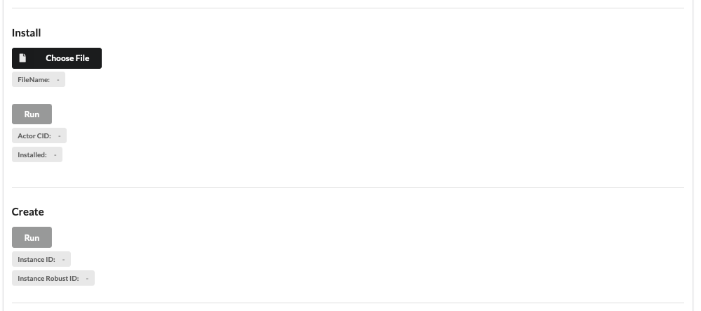
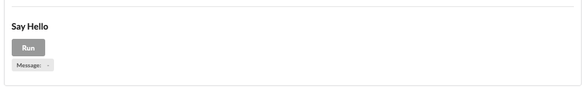

# Filecoin Hello World Actor on AssemblyScript
[](https://opensource.org/licenses/Apache-2.0)
[](https://github.com/Zondax/fil-hello-world-actor-as/blob/master/.github/workflows/main.yaml)


---


_Please visit our website at [zondax.ch](https://www.zondax.ch)_

---

## Introduction
This is the first smart contract you should check in order to learn how to create your own one. It implements:
- Save a counter to storage
- Load data from storage
- Create a constructor
- Export a basic method

It was built using the FVM SDK for AssemblyScript. Please, go to the [project](https://github.com/Zondax/fvm-as-sdk) in order to know more about it.

## Build
You just need to run these two steps:
```
make deps
make build
```
The binary file you need to use it `release-final.wasm`.

## Deploy

In order to run it on a lotus node, first you will need to deploy one. Please, refer to [this repo](https://github.com/Zondax/rosetta-filecoin/tree/experimental/dev-fmv-m2).

### On Lotus node
#### Copy binary to pod
```
kubectl config use-context sandbox
kubectl -n filecoin-node cp build/final-release.wasm <pod-name>:/tmp/fil-actor-hello-world-as.wasm
```
#### To install and instantiate the actor
```
lotus chain install-actor <path-to-binary>
lotus chain create-actor <actor-id-from-previous-step>
```

### Using the web page
On the `tests/browser` folder, you will find a web page ready to allow you to interact with the smart contract. In order to 
run it, please you need to set the an `.env` file with the required values. And now run:
```
yarn install
yarn dev
```

A web server will be listening to requests on `localhost:3000`. In order to install and instantiate the smart contract, please follow these to steps:



## Tests 

### On Lotus node

#### Run say_hello method
```
lotus chain invoke <address-id-from-create-actor-step> 2
```

### Using the web page
Please, follow the flow the web page offers you in order to run the say_hello method. 
The only thing you need to keep in mind is the fact you will need to install and instantiate 
the smart contract first.



### On Rust VM

Be sure to have `Cargo` installed.
```
cd tests/local-vm
cargo r
```

## Implementations on other SDKs
- [Rust](https://github.com/raulk/fil-hello-world-actor)
- [GoLang](https://github.com/ipfs-force-community/go-fvm-sdk)

